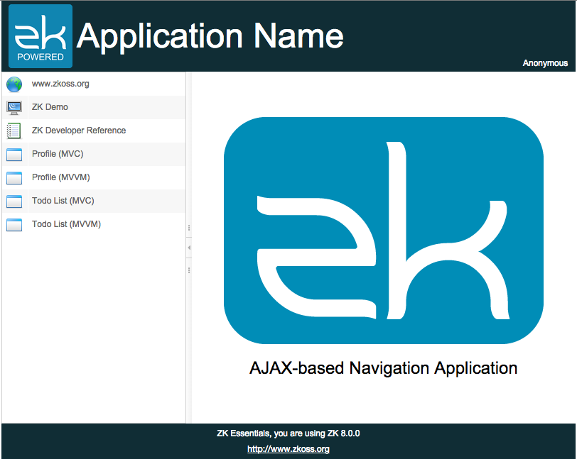
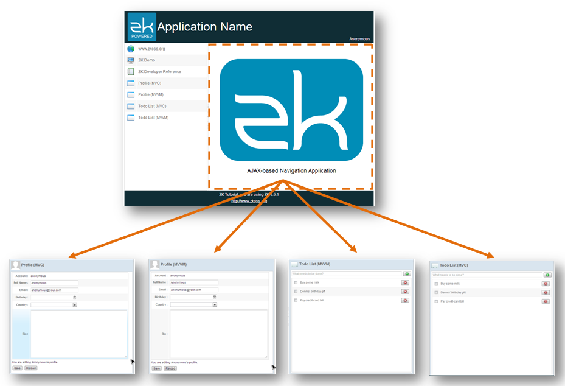

# Navigation and Template
# Overview


In traditional navigation, a user usually switches to different
functions by visiting different pages of an application, a.k.a
page-based navigation. In ZK, we can have another choice to design the
navigation in AJAX-based, and users don't need to visit different
pages. In page-based navigation, users need to switch pages frequently,
we should maintain a consistent page design throughout whole application
to help users keep track of where they are. Luckily, since 8.0 ZK provides **Template Injection** to keep multiple pages in the same style easily.


In this chapter, the example application we are going to build looks as follows:



The sidebar is used for navigation control. There are 7 menu items on the sidebar, and the lower 4 items lead you to different functions. They only change the central area's content. All other areas are unchanged to maintain a consistent layout style during the navigation.


# Template

In our example application, we want to keep the header, the sidebar, and
the footer unchanged regardless of which function a user chooses. Only the central area changes its content according to the function chosen by users.

In page-based navigation, each function is put into a separated page, and we need to keep a consistent layout style. One way is to copy the unchanged part from one zul to another, but it is hard to maintain. Fortunately, ZK provides a [Template Injection]() technique that lets you define a zul as a template and apply (inject) it to multiple zul pages afterwards. All zul pages that apply the same template zul have the same layout, so changing the template zul can change the layout of all pages once.

The steps to use a template are:

1. Create a zul as a template
2. Declare a template with a name in the target zul
3. Apply the template in the target zul with its name

Then when you visit the target zul page, ZK will insert the template to the position where you apply it upon template's name.

## 1. Create a Template ZUL

Creating a template zul is nothing different from creating a ordinary zul.

**chapter7/pagebased/layout/template.zul**

```xml
<zk>
	<borderlayout hflex="1" vflex="1">
		<north height="100px" border="none" >
			<include src="/chapter3/banner.zul"/>
		</north>
		<west width="260px" border="none" collapsible="true" splittable="true" minsize="300">
			<include src="/chapter7/pagebased/layout/sidebar.zul"/>
		</west>
		<center id="mainContent" autoscroll="true" border="none" >
			<apply template="center"/>
		</center>
		<south height="50px" border="none">
			<include src="/chapter3/footer.zul"/>
		</south>
	</borderlayout>
</zk>
```

-   Line 10: Apply another template which is a changed part.


## 2. Declare the Template

After creating a template zul, we shoulde decalre a template by `<template>` before applying it like:

`<template name="layout" src="/chapter7/pagebased/layout/template.zul"/>`

This tag will decalre a template named `layout` with its source zul path.

## 3. Apply the Template

Then we can apply the template with `<apply>`, which is a *shadow component* introduced in ZK 8, and its name like:

`<apply template="layout"/>`

The shadow component which is like [shadow DOM](http://w3c.github.io/webcomponents/spec/shadow/) doesn't create a corresponding component on server side (and client side). It just injectc its components inside into current page.

# Page-based Navigation

A traditional web application's navgation is usually designed as page-based. Each function corresponds to an independent page with independent URL. The navigation is very clear for users as they know where they are from the URL and they can press "go back" button on their browser to go back to previous pages in history. But the drawback is users have to wait whole page reloading every time they switch to a
function. Additionally, developers also have to maintain multiple pages
that have similar contents but applying a template zul can reduce this problem.


<div style="text-align:center">
<strong>Page-based Navigation</strong>
</div>

<br/>
To build a page-based navigation, first you should prepare corresponding pages for those items in the sidebar.

From below image, you can see there are 4 zul pages which correspond
to items in the sidebar under "chpater7\\pagebased" (index-profile-mvc.zul, index-profile-mvvm.zul, index-todolist-mvc.zul, index-todolist-mvvm.zul). Then we can link four items of the sidebar to these zul pages by redirecting a browser.


Next, we apply the template zul created before on those 4 pages. As you can see in previouse `template.zul`, in order to inject different content in the `<center>` area, we apply a template named `center` that is not declared in the `template.zul`. Therefore, We can decalre `center` template with different path to inject different content with the same layout.

**/chapter7/pagebased/index-profile-mvc.zul**

```xml
<?link rel="stylesheet" type="text/css" href="/style.css"?>
<zk>
<div height="100%">
	<template name="layout" src="/chapter7/pagebased/layout/template.zul"/>
	<apply template="layout"/>
	<template name="center" src="/chapter5/profile-mvc.zul"/>
</div>
</zk>
```

- Line 6: Apply the template named 'layout'.
- Line 7: Declare a tempalte injected in `layout` template.

Our example application creates those menu items dynamically upon a
configuration, so we should initialize configuration.

**Page-based navigation's sidebar configuration**

```java
public class SidebarPageConfigPagebasedImpl implements SidebarPageConfig{

    HashMap<String,SidebarPage> pageMap = new LinkedHashMap<String,SidebarPage>();
    public SidebarPageConfigPagebasedImpl(){
        pageMap.put("zk",new SidebarPage("zk","www.zkoss.org","/imgs/site.png","http://www.zkoss.org/"));
        pageMap.put("demo",new SidebarPage("demo","ZK Demo","/imgs/demo.png","http://www.zkoss.org/zkdemo"));
        pageMap.put("devref",new SidebarPage("devref","ZK Developer Reference","/imgs/doc.png"
                ,"http://books.zkoss.org/wiki/ZK_Developer's_Reference"));

        pageMap.put("fn1",new SidebarPage("fn1","Profile (MVC)","/imgs/fn.png"
                ,"/chapter7/pagebased/index-profile-mvc.zul"));
        pageMap.put("fn2",new SidebarPage("fn2","Profile (MVVM)","/imgs/fn.png"
                ,"/chapter7/pagebased/index-profile-mvvm.zul"));
        pageMap.put("fn3",new SidebarPage("fn3","Todo List (MVC)","/imgs/fn.png"
                ,"/chapter7/pagebased/index-todolist-mvc.zul"));
        pageMap.put("fn4",new SidebarPage("fn4","Todo List (MVVM)","/imgs/fn.png"
                ,"/chapter7/pagebased/index-todolist-mvvm.zul"));
    }

    ...

}
```
- Line 10\~17: Specify URL and related data for each menu item's configuration.

The following code shows how to redirect a user to an independent page
when users click a menu item in the sidebar.

**Controller for page-based navigation**

```java
public class SidebarPagebasedController extends SelectorComposer<Component>{

    ...

    //wire service
    SidebarPageConfig pageConfig = new SidebarPageConfigPagebasedImpl();

    @Override
    public void doAfterCompose(Component comp) throws Exception{
        super.doAfterCompose(comp);

        //to initial view after view constructed.
        Rows rows = fnList.getRows();

        for(SidebarPage page:pageConfig.getPages()){
            Row row = constructSidebarRow(page.getName(),page.getLabel(),page.getIconUri(),page.getUri());
            rows.appendChild(row);
        }
    }

    private Row constructSidebarRow(String name,String label, String imageSrc, final String locationUri) {

        //construct component and hierarchy
        Row row = new Row();
        Image image = new Image(imageSrc);
        Label lab = new Label(label);

        row.appendChild(image);
        row.appendChild(lab);

        //set style attribute
        row.setSclass("sidebar-fn");

        EventListener<Event> actionListener = new SerializableEventListener<Event>() {
            private static final long serialVersionUID = 1L;

            public void onEvent(Event event) throws Exception {
                //redirect current url to new location
                Executions.getCurrent().sendRedirect(locationUri);
            }
        };

        row.addEventListener(Events.ON_CLICK, actionListener);

        return row;
    }
}
```
- Line 15: Create menu items in the sidebar upon configurations with *Row*s.
- Line 39: Add an event listener to redirect a browser to the URL specified in the menu item a user clicks.

Visit <http://localhost:8080/essentials/chapter7/pagebased/index.zul>.
You will see the URL changes and whole page reloads each time you click
a different menu item.


# AJAX-based Navigation - MVC approach

When switching between different functions in paged-based navigation,
you find that only central area's content is different among those pages
and other three areas (header, sidebar, and footer) contain identical
content. But in page-based navigation, a browser has to reload all
contents no matter they are identical to previous page when switching to
another function. With AJAX's help, ZK allows you to implement another
navigation way that only updates necessary part of a page instead of
reloading the whole page.


<div style="text-align:center">
<strong>AJAX-based Navigation</strong>
</div>

The easiest way to implement AJAX-based navigation is to change `src`
attribute of *Include* component. It can change only partial content of
an page instead of redirecting to another page to achieve the navigation
purpose. This navigation way switches functions by only replacing a
group of components instead of whole page and therefore has faster
response than page-based one. But it doesn't change a browser's URL when
each time switching to a different function. However, if you want users
can keep track of different functions with bookmark, please refer to [
Browser History Management](ZK_Developer's_Reference/UI_Patterns/Browser_History_Management).

We will demonstrate AJAX-based navigation with the same layout example.

Below is the index page, its content is nearly the same as the index
page of page based example except it replaces all `<include>` with `<apply>`.

**chapter7/ajaxbased/index.zul**
```xml
<?link rel="stylesheet" type="text/css" href="/style.css"?>
<zk>
	<borderlayout hflex="1" vflex="1" apply="org.zkoss.essentials.chapter7.ajaxbased.BookmarkChangeController">
		<north height="100px" border="none" >
			<apply templateURI="/chapter3/banner.zul"/>
		</north>
		<west width="260px" border="none" collapsible="true" splittable="true" minsize="300">
			<apply templateURI="/chapter7/ajaxbased/sidebar.zul"/>
		</west>
		<center id="mainContent" autoscroll="true" border="none" self="@insert(content)">
			<apply templateURI="/chapter7/ajaxbased/mainContent.zul"/>
		</center>
		<south height="50px" border="none">
			<apply templateURI="/chapter3/footer.zul"/>
		</south>
	</borderlayout>
</zk>
```


**Replace `<include>` with `<apply>`**

As we don't need to dynamically change the path of those 3 areas (banner, side bar, footer), using `<apply>` is a better choice than `<include>`. Because `<apply>` create neither an extra `<div>` enclosin its content nor a id space. It's the main strength of using a shadow component that doesn't create a real component.


**chapter7/ajaxbased/mainContent.zul**
```xml
<zk>
	<include id="mainInclude"  src="/chapter7/ajaxbased/home.zul"/>
</zk>
```
- Line 2: We give the component id for we can find it later with ZK selector.

This navigation is mainly implemented by changing the `src` attribute of
the *Include* component to switch between different zul pages so that it
only reloads included components without affecting other areas . We
still need to initialize sidebar configuration:

**AJAX-based navigation's sidebar configuration**

``` java
public class SidebarPageConfigAjaxbasedImpl implements SidebarPageConfig{

    HashMap<String,SidebarPage> pageMap = new LinkedHashMap<String,SidebarPage>();
    public SidebarPageConfigAjaxbasedImpl(){
        pageMap.put("zk",new SidebarPage("zk","www.zkoss.org","/imgs/site.png","http://www.zkoss.org/"));
        pageMap.put("demo",new SidebarPage("demo","ZK Demo","/imgs/demo.png","http://www.zkoss.org/zkdemo"));
        pageMap.put("devref",new SidebarPage("devref","ZK Developer Reference","/imgs/doc.png","http://books.zkoss.org/wiki/ZK_Developer's_Reference"));

        pageMap.put("fn1",new SidebarPage("fn1","Profile (MVC)","/imgs/fn.png","/chapter5/profile-mvc.zul"));
        pageMap.put("fn2",new SidebarPage("fn2","Profile (MVVM)","/imgs/fn.png","/chapter5/profile-mvvm.zul"));
        pageMap.put("fn3",new SidebarPage("fn3","Todo List (MVC)","/imgs/fn.png","/chapter6/todolist-mvc.zul"));
        pageMap.put("fn4",new SidebarPage("fn4","Todo List (MVVM)","/imgs/fn.png","/chapter6/todolist-mvvm.zul"));
    }
    ...
}
```

-   Line 9 \~ 12: Because we only need those pages that doesn't have
    header, sidebar, and footer, we can re-use those pages written in
    previous chapters.

In the sidebar controller, we get the *Include* component and change its `src`
according to the menu item's URL.

**Controller for AJAX-based navigation**

```java
public class SidebarAjaxbasedController extends SelectorComposer<Component>{

    @Wire
    Grid fnList;

    //wire service
    SidebarPageConfig pageConfig = new SidebarPageConfigAjaxbasedImpl();

    @Override
    public void doAfterCompose(Component comp) throws Exception{
        super.doAfterCompose(comp);

        //to initial view after view constructed.
        Rows rows = fnList.getRows();

        for(SidebarPage page:pageConfig.getPages()){
            Row row = constructSidebarRow(page.getName(),page.getLabel(),page.getIconUri(),page.getUri());
            rows.appendChild(row);
        }
    }

    private Row constructSidebarRow(final String name,String label, String imageSrc, final String locationUri) {

        //construct component and hierarchy
        Row row = new Row();
        Image image = new Image(imageSrc);
        Label lab = new Label(label);

        row.appendChild(image);
        row.appendChild(lab);

        //set style attribute
        row.setSclass("sidebar-fn");

        //new and register listener for events
        EventListener<Event> onActionListener = new SerializableEventListener<Event>(){
            private static final long serialVersionUID = 1L;

            public void onEvent(Event event) throws Exception {
                //redirect current url to new location
                if(locationUri.startsWith("http")){
                    //open a new browser tab
                    Executions.getCurrent().sendRedirect(locationUri);
                }else{
                    //use iterable to find the first include only
                    Include include = (Include)Selectors.iterable(fnList.getPage(), "#mainInclude")
                            .iterator().next();
                    include.setSrc(locationUri);

                    ...
                }
            }
        };
        row.addEventListener(Events.ON_CLICK, onActionListener);

        return row;
    }

}
```

-   Line 46,47: Since *Include* is not a child component of the
    component that `SidebarAjaxbasedController` applies to, we cannot
    use `@Wire` to retrieve it. Therefore, we use `Selectors.iterable()`
    to get components with the id selector from the page. Because ZK
    combines included components and its parent into one ZK page.
-   Line 48: Change the `src` to the corresponding URL that belongs to
    the clicked menu item.

Visit the
http://localhost:8080/essentials/chapter7/ajaxbased/index.zul to see
the result.


# AJAX-based Navigation - MVVM approach

Surely we can also implement AJAX-based navigation in MVVM approach. Every page are quite similar with previous section. Just switch different pages with data binding.

In this example, we modularize each page with an independent ViewModel. In order to communicate between sidebar and content area that are bound with different ViewModels, we need to use [global command binding](http://books.zkoss.org/zk-mvvm-book/8.0/data_binding/global_command_binding.html). You can treat it as a command binding mentioned in previous chapter, but it can invoke a command method declared in other ViewModels.

The basic idea is: sidebar sends a global command when a user clicks an item then content area change *Include* component's `src` attribute to navigate pages.


**chapter7/ajaxbased_mvvm/sidebar.zul**
```xml
    <rows>
		<template name="model">
			<row sclass="sidebar-fn" onClick="@global-command('onNavigate', page=each)">
				<image src="@load(each.iconUri)"/>
				<label value="@load(each.label)"/>
			</row>
		</template>
	</rows>
```
- Line 3: Specify a global command binding and pass `SidebarPage` as a parameter


**chapter7/ajaxbased_mvvm/mainContent.zul**
```xml
<zk>
	<include id="mainInclude"
		viewModel="@id('vm') @init('org.zkoss.essentials.chapter7.ajaxbased.mvvm.NavigationViewModel')"
		src="@load(vm.includeSrc)" />
</zk>
```

The code below demonstrate how to declare a global command method and receive a parameters.
```java
package org.zkoss.essentials.chapter7.ajaxbased.mvvm;

import org.zkoss.bind.annotation.BindingParam;
import org.zkoss.bind.annotation.GlobalCommand;
import org.zkoss.bind.annotation.NotifyChange;
import org.zkoss.essentials.services.SidebarPage;
import org.zkoss.zk.ui.Executions;

public class NavigationViewModel {

	private String includeSrc = "/chapter7/ajaxbased/home.zul";

	@GlobalCommand("onNavigate")
	@NotifyChange("includeSrc")
	public void onNavigate(@BindingParam("page") SidebarPage page) {
		String locationUri = page.getUri();
		String name = page.getName();

		//redirect current url to new location
		if(locationUri.startsWith("http")){
			//open a new browser tab
			Executions.getCurrent().sendRedirect(locationUri);
		} else {
			includeSrc = locationUri;

			//advance bookmark control,
			//bookmark with a prefix
			if(name!=null){
				Executions.getCurrent().getDesktop().setBookmark("p_"+name);
			}
		}
	}

	public String getIncludeSrc() {
		return includeSrc;
	}

}
```


# Source Code
-   [ZUL
    pages](https://github.com/zkoss/zkessentials/tree/master/src/main/webapp/chapter7)
-   [Java](https://github.com/zkoss/zkessentials/tree/master/src/main/java/org/zkoss/essentials/chapter7)


